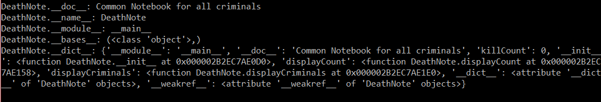
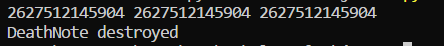
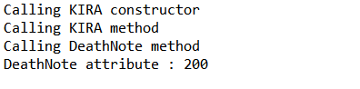
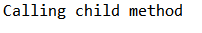

# Some concepts of OOPs :

+ ***<u>Class</u>*** − A user-defined prototype for an object that defines a set of attributes that characterize any object of the class. The attributes are data members (class variables and instance variables) and methods, accessed via dot notation.  

+ ***<u>Class variable</u>*** − A variable that is shared by all instances of a class. Class variables are defined within a class but outside any of the class's methods. Class variables are not used as frequently as instance variables are.

+  ***<u>Data member</u>*** − A class variable or instance variable that holds data associated with a class and its objects.

+ ***<u>Function overloading</u>*** − The assignment of more than one behavior to a particular function. The operation performed varies by the types of objects or arguments involved.

+ ***<u>Instance variable</u>*** − A variable that is defined inside a method and belongs only to the current instance of a class.

+ ***<u>Inheritance</u>*** − The transfer of the characteristics of a class to other classes that are derived from it.

+ ***<u>Instance</u>*** − An individual object of a certain class. An object obj that belongs to a class Circle, for example, is an instance of the class Circle.

+ ***<u>Method</u>*** − A special kind of function that is defined in a class definition.

+ ***<u>Object</u>*** − A unique instance of a data structure that's defined by its class.
An object comprises both data members (class variables and instance variables) and methods.
*****************************************************************************************

# Creating Class
class keyword is used to make a class

Example -
```Python
class DeathNote:
  `optional class document string and can be accessed by AK.__doc__`
```

# Creating methods inside classes

```Python
class DeathNote:
   'Common base class for all employees'
   killCount = 0 # empCount is class variable

   def __init__(self, name, cause):
      self.name = name
      self.cause = cause
      DeathNote.killCount += 1
# defining method displayCount    
   def displayCount(self):
     print("Total Deaths = %d" % Employee.empCount)
# defining method displayCount
   def displayCriminals(self):
      print("Name : ", self.name,  ", Salary: ", self.salary)

```

  + the variable empCount is class variable and can be accessed as DeathNote.killCount from inside the class or outside the class.

  + The first method __init__() is a special method, which is called class constructor or initialization method that Python calls when you create a new instance of this class.

  + You declare other class methods like normal functions with the exception that the first argument to each method is self. Python adds the self argument to the list for you; you do not need to include it when you call the methods.

# Creating insatnce objects

```Python
# creating first object
criminal_1=DeathNote("Name_1","Cause_1")
# creating second object
criminal_2=DeathNote("Name_2","Cause_2")
```
+ To create instances of a class, you call the class using class name and pass in whatever arguments its __init__ method accepts.   


# Accessing attributes
```Python
criminal_1.displayCriminals()
criminal_2.displayCriminals()
print("Total criminals = %d" % DeathNote.killCount)
```

***You can add attributes anytime*** :
```python
criminal_1.death_date = "31/12/2018" # adding an atribute death_date
```
***You can modify attributes anytime*** :
```python
criminal_1.death_date = "15/8/2018" # modifying attribute death_date
```

***You can delete attributes anytime*** :
```Python
del criminal_1.death_date    # deleting attribute death_date
```

Instead of using the normal statements to access attributes, you can use the following functions −

  + **getattr(obj, name[, default])** − *to access the attribute of object.*

  +  **hasattr(obj,name)** − *to check if an attribute exists or not.*

  +  **setattr(obj,name,value)** − *to set an attribute. If attribute does not exist, then it would be created.*

  +  **delattr(obj, name)** − *to delete an attribute.*

examples -

```Python
hasattr(criminal_1,'death_date')    # Returns true if 'death_date' attribute exists
getattr(criminal_1,'death_date')    # Returns value of 'death_date' attribute
setattr(criminal_1,'death_date', 8) # Set attribute 'death_date' at 8
delattr(criminal_1,'death_date')    # Delete attribute 'death_date'
```

# Built-In Class Attributes

Every Python class keeps following built-in attributes and they can be accessed using dot operator like any other attribute −

  + **\__dict__** : *Dictionary containing the class's namespace.*
  + **\__doc__** : *Class documentation string or none, if undefined.*
  + **\__name__** : *Class name.*
  + **\__module__** : *Module name in which the class is defined. This attribute is "\__main__" in interactive mode.*
  + **\__bases__** − *A possibly empty tuple containing the base classes, in the order of their occurrence in the base class list.*

> examples:

```Python
print("DeathNote.__doc__:", DeathNote.__doc__)

print("DeathNote.__name__:", DeathNote.__name__)

print("DeathNote.__module__:", DeathNote.__module__)

print("DeathNote.__bases__:", DeathNote.__bases__)

print("DeathNote.__dict__:", DeathNote.__dict__)
```
Output wil be :



# Destroying objects (Garbage collection)

Python deletes unneeded objects (built-in types or class instances) automatically to free the memory space.Python's garbage collector runs during program execution and is triggered when an object's reference count reaches zero. An object's reference count changes as the number of aliases that point to it changes.

*An object's reference count increases when it is assigned a new name or placed in a container (list, tuple, or dictionary). The object's reference count decreases when it's deleted with del, its reference is reassigned, or its reference goes out of scope. When an object's reference count reaches zero, Python collects it automatically.*

 a class can implement the special method \__del__(), called a destructor, that is invoked when the instance is about to be destroyed. This method might be used to clean up any non memory resources used by an instance.

This \__del__() destructor prints the class name of an instance that is about to be destroyed −

```Python
class DeathNote:
   def __init__(self, name=0, cause=0):
      self.name = name
      self.cause= cause
   def __del__(self):
      class_name = self.__DeathNote__.__name__
      print(class_name, "destroyed")

criminal_1 = DeathNote()
criminal_2 = criminal_1
criminal_3 = criminal_1
print(id(criminal_1), id(criminal_2), id(crimimnal_3)) # prints the ids of the obejcts
del criminal_1
del criminal_2
del criminal_3
```
Output will be :




# Class Inheritance

 you can create a class by deriving it from a preexisting class by listing the parent class in parentheses after the new class name.

 The child class inherits the attributes of its parent class, and you can use those attributes as if they were defined in the child class. A child class can also override data members and methods from the parent.

 ### <u>Syntex</u> :
```Python
 class SubClassName (ParentClass1[, ParentClass2, ...]):
   'Optional class documentation string'
   class_suite
```

***Example*** :
```Python
class DeathNote:        # define parent class
   DeathAttr = 100
   def __init__(self):
      print("Calling DeathNote constructor")

   def DeathMethod(self):
      print('Calling DeathNote method')

   def setAttr(self, attr):
      DeathNote.parentAttr = attr

   def getAttr(self):
      print("DeathNote attribute :", DeathNote.parentAttr)

class KIRA(DeathNote): # define child class
   def __init__(self):
      print("Calling KIRA constructor")

   def KIRAMethod(self):
      print('Calling KIRA method')

c=KIRA()          # instance of child
c.KIRAMethod()      # child calls its method
c.DeathMethod()     # calls parent's method
c.setAttr(200)       # again call parent's method
c.getAttr()          # again call parent's method
```
**Output will be** :



> Here DeathNote is parent class and KIRA is child class.

You can use issubclass() or isinstance() functions to check a relationships of two classes and instances.
+ *The issubclass(sub, sup) boolean function returns true if the given subclass sub is indeed a subclass of the superclass sup.*
+ *The isinstance(obj, Class) boolean function returns true if obj is an instance of class Class or is an instance of a subclass of Class.*

# Overriding Methods

You can always override your parent class methods. One reason for overriding parent's methods is because you may want special or different functionality in your subclass.

**Example** :
```Python
class DeathNote:        # define parent class
   def Criminals(self):
      print('Calling parent method')

class KIRA(DeathNote): # define child class
   def Criminals(self):
      print('Calling child method')

c = KIRA()          # instance of child
c.Criminals()         # child calls overridden method
```
**Output will be** :



# Base Overloading Methods

Following table lists some generic functionality that you can override in your own classes −

1. **\__init__ ( self [,args...] )**

     Constructor (with any optional arguments)  
     Sample Call : obj = className(args)
2. **\__del__( self )**  
     Destructor, deletes an object  
     Sample Call : del obj
3. **\__repr__( self )**  
    Evaluable string representation  
    Sample Call : repr(obj)
4. **\__str__( self )**  
    Printable string representation  
    Sample Call : str(obj)
5. **\__cmp__ ( self, x )**  
    Object comparison  
    Sample Call : cmp(obj, x)

# Overloading operators

Suppose you have created a Vector class to represent two-dimensional vectors, what happens when you use the plus operator to add them? Most likely Python will yell at you.


You could, however, define the \__add__ method in your class to perform vector addition and then the plus operator would behave as per expectation.

Example :

```python
class Vector:
   def __init__(self, a, b):
      self.a = a
      self.b = b

   def __str__(self):
      return 'Vector (%d, %d)' % (self.a, self.b)

   def __add__(self,other):
      return Vector(self.a + other.a, self.b + other.b)

v1 = Vector(2,10)
v2 = Vector(5,-2)
print v1 + v2
```
